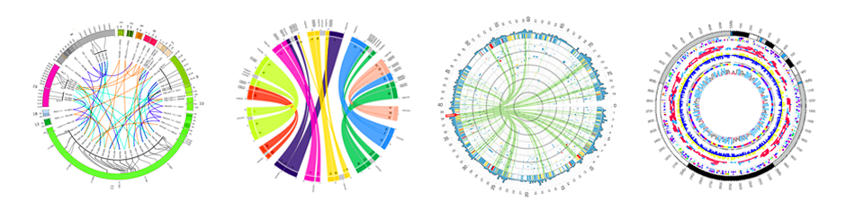
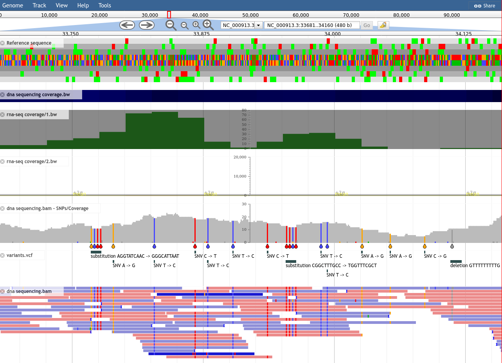
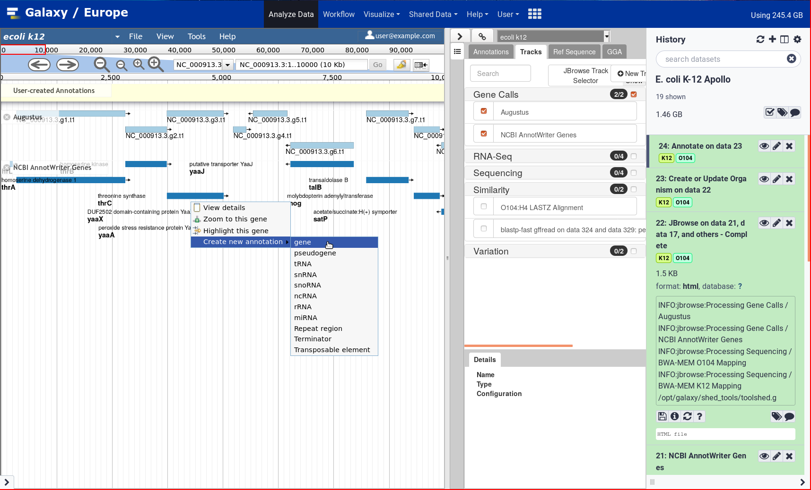

# Galaxy Genome Annotation

GGA is a group of projects focused on supporting genome annotation inside Galaxy, in particular:

- Galaxy tools and workflows
- Training material
- Docker images for GMOD applications
- Python libraries to interact with GMOD applications
- Apollo tooling and service

## Galaxy tools

### [Analysis tools](https://github.com/galaxyproject/tools-iuc)

Various Galaxy tools for Genome Annotation are in the [IUC repository](https://github.com/galaxyproject/tools-iuc), including: Augustus, BUSCO, FeelNC, Funannotate, Gffread, InterProScan, Maker, Metaeuk, Prokka, Repeat Masker, Repeat Modeler, Snap

Other tools are also available on other repositories: [Antismash](https://github.com/bgruening/galaxytools/tree/master/tools/antismash), [Braker](https://github.com/genouest/galaxy-tools/tree/master/tools/braker), [EggNOG-Mapper](https://github.com/galaxyproteomics/tools-galaxyp/tree/master/tools/eggnog_mapper)

## [Visualisation tools](https://github.com/galaxyproject/tools-iuc)

We are maintaining the following Galaxy tools for the visualisation of annotations:

- [Circos](https://github.com/galaxyproject/tools-iuc/tree/master/tools/circos): allows to build of a huge variety of highly configurable Circos plot.
- [JBrowse](https://github.com/galaxyproject/tools-iuc/tree/master/tools/jbrowse): allows to generate fully customisable JBrowse instances.
- [JBrowse2](https://github.com/galaxyproject/tools-iuc/pull/3997) (work in progress): based on the new generation of JBrowse.

### [Galaxy tools for GMOD apps](https://github.com/galaxy-genome-annotation/galaxy-tools)

Galaxy tools to interact with GMOD applications (see below for the corresponding Docker images and Python libraries).

## Training Material

Learn how to annotate new genomes by following the [Genome Annotation tutorials on the Galaxy Training Network](https://training.galaxyproject.org/training-material/topics/genome-annotation/)! Reusable workflows are provided together with detailed tutorials and videos.

## Apollo tooling and service

### [Apollo server at UseGalaxy.eu](https://usegalaxy.eu/apollo/)

Based on the various components listed here, UseGalaxy.eu is hosting an [Apollo server](https://usegalaxy.eu/apollo/), freely accessible to the community.

Using Galaxy, any user can upload its own organism, and start curating gene models collaboratively with other users.

Check out the [GTN training material](https://training.galaxyproject.org/training-material/topics/genome-annotation/tutorials/apollo/tutorial.html) to learn how to use it!

### [Permapol](https://github.com/genouest/permapol/)

[Permapol](https://github.com/genouest/permapol/) is a permission manager for Apollo, designed to ease collaboration when coupled with a Galaxy instance.

### [Apolpi](https://github.com/galaxy-genome-annotation/apolpi/)

[Apolpi](https://github.com/galaxy-genome-annotation/apolpi/) is a tiny Flask application reimplementing a specific API function (organism listing) of Apollo, to make it run way faster.

### [Apollo report](https://github.com/abretaud/docker-apollo-report)

[Apollo report](https://github.com/abretaud/docker-apollo-report/) is a Docker image that contains everything needed to generate an Apollo per-user report each day. Based on the validation rules defined at http://bipaa.genouest.org/.

## Docker images

### [docker-galaxy-genome-annotation](https://github.com/galaxy-genome-annotation/docker-galaxy-genome-annotation)

Galaxy Docker repository with tools for Genome Annotation. The image is built with tools for Assembly (Spades, Mira), Structural Prediction (Glimmer, Augustus), Functional Prediction (BLAST+, InterProScan, BLAST, Diamond, Blast2GO), various Utilities (FASTA manipulation tools, EMBOSS), tools for Comparative Genomics (CD-Hit, ClustalW, AntiSmash, mummer), and finally Annotation & Visualization tools (Apollo Tools, JBrowse-in-Galaxy, JBrowse-in-Galaxy Extras, Tripal Admin tools, Circos)

### [docker-tripal](https://github.com/galaxy-genome-annotation/docker-tripal)

A production ready Docker image for Tripal v2.x and v3.x.

### [docker-jbrowse](https://github.com/galaxy-genome-annotation/docker-jbrowse)

A production ready Docker image for JBrowse.

### [docker-chado](https://github.com/galaxy-genome-annotation/docker-chado)

A production ready Docker image for Chado database. The image is built automatically using SQL dumps produced by [chado-schema-builder](https://github.com/erasche/chado-schema-builder/), including up-to-date ontologies.

### [dockerized-gmod-deployment](https://github.com/galaxy-genome-annotation/dockerized-gmod-deployment)

If customizing the docker-galaxy-genome-annotation image isn't your style, this is a preconfigured deployment of Galaxy + Apollo + Chado + Tripal + JBrowse + JBrowse REST API + PostGraphQL + JBrowse GraphQL Experiment all as a docker-compose.yml

## Python libraries

### [python-apollo](https://github.com/galaxy-genome-annotation/python-apollo)

Python library for talking to Apollo API. This includes the experimental `Arrow` Apollo client.

### [python-tripal](https://github.com/galaxy-genome-annotation/python-tripal)

A Python library for interacting with Tripal

### [python-chado](https://github.com/galaxy-genome-annotation/python-chado)

A Python library for interacting with Chado database

## Experiments

### [apollo-git-backup](https://github.com/galaxy-genome-annotation/apollo-git-backup)

Backup an apollo instance to a git repository

### [apollo-google-docs-integration](https://github.com/galaxy-genome-annotation/apollo-google-docs-integration)

Experimental work for a plugin to allow referencing data from Apollo. For genomes which are re-opened / re-numbered / etc. between drafting and publication, it can be extremely helpful to reference persistent identifiers.

## Support

This material is based upon work supported by the National Science Foundation under Grant Number (Award 1565146) and with the support of the Erasmus+ programme of the European Union (2020-1-NL01-KA203-064717).

